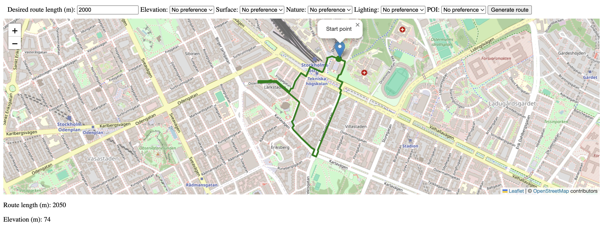

# Running route generation
Application for generating running routes based on the user's preferences



## Installation

Make sure you have **Python 3.9 or later** installed.

### 1. Clone the repository
```bash
git clone https://github.com/oskaredv/running-routes.git
cd running-routes
```

### 2. Create a virtual environment
```bash
python -m venv venv
```

### 3. Activate the virtual environment
**macOS / Linux**
```bash
source venv/bin/activate
```
**Windows (PowerShell)**
```bash
venv\Scripts\Activate
```

### 4. Install dependencies
```bash
pip install -r requirements.txt
```

### 5. Run the application
```bash
python app.py
```